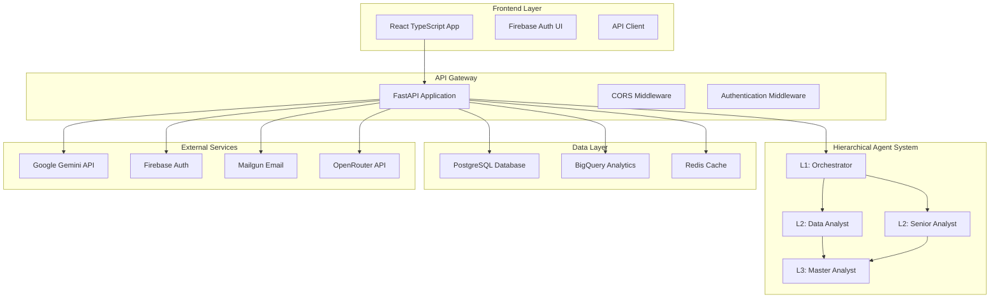
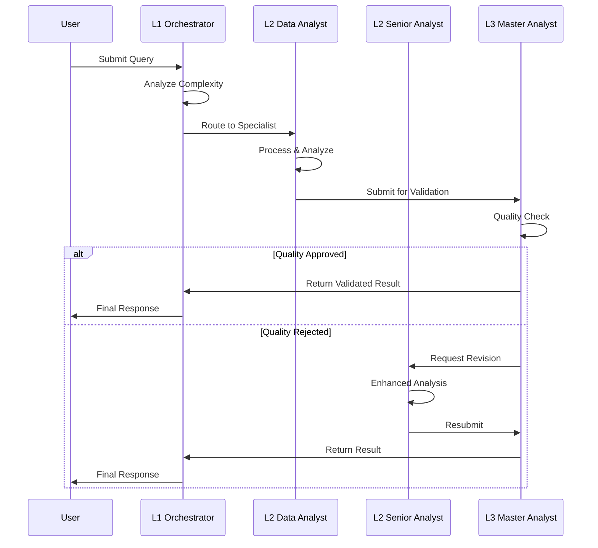

# VENDORA Unified Platform - Deployment Roadmap

## Executive Summary

VENDORA is a sophisticated multi-agent AI platform for automotive dealership analytics with a hierarchical 3-level agent architecture. The codebase demonstrates strong architectural principles but requires strategic deployment preparation to ensure production readiness.

**Deployment Timeline**: Staging environment setup within 1 week, followed by production deployment with comprehensive testing approach.

---

## System Architecture Overview

### Current Architecture Analysis



### Agent Flow Architecture



---

## Technical Debt & Risk Assessment

### 🔴 High Priority Issues (Must Fix Before Staging)

| Issue | Impact | File(s) | Effort | Risk Level |
|-------|--------|---------|--------|------------|
| Missing MCP Integration | Application crashes on startup | `src/fastapi_main.py` | 4h | Critical |
| Database Schema Mismatch | Data inconsistency | `db/schema.ts`, various services | 8h | High |
| Service Dependencies | Import failures | `services/hierarchical_flow_manager.py` | 6h | High |
| Security Configuration | Vulnerable CORS setup | `src/fastapi_main.py` | 2h | High |

### 🟡 Medium Priority Issues (Fix During Staging)

| Issue | Impact | File(s) | Effort | Risk Level |
|-------|--------|---------|--------|------------|
| Import Path Inconsistencies | Maintainability issues | Multiple files | 4h | Medium |
| Error Handling Gaps | Poor user experience | API endpoints | 6h | Medium |
| Testing Coverage | Deployment confidence | `tests/` | 12h | Medium |
| Performance Optimization | Scalability concerns | Core services | 8h | Medium |

### 🟢 Low Priority Issues (Production Phase)

| Issue | Impact | File(s) | Effort | Risk Level |
|-------|--------|---------|--------|------------|
| Documentation Gaps | Developer experience | All modules | 16h | Low |
| Monitoring Configuration | Observability | `monitoring/` | 4h | Low |
| Code Quality | Maintainability | Various files | 8h | Low |

---

## Phase 1: Staging Environment Setup (Week 1)

### Day 1-2: Critical System Fixes

#### 🎫 Ticket #001: Remove MCP Integration Dependencies
**Priority**: Critical  
**Effort**: 4 hours  
**Assignee**: Backend Team Lead

**Description**: Remove non-existent `fastapi-mcp` package integration that causes startup failures.

**Tasks**:
- [ ] Remove MCP imports from [`src/fastapi_main.py`](src/fastapi_main.py)
- [ ] Create fallback configuration for MCP features
- [ ] Update [`requirements.txt`](requirements.txt) 
- [ ] Test application startup without MCP

**Code Changes**:
```python
# src/fastapi_main.py - REMOVE these lines:
# from fastapi_mcp import MCPMiddleware
# app.add_middleware(MCPMiddleware)

# ADD fallback configuration:
MCP_CONFIG = {
    "enabled": False,
    "fallback_mode": True,
    "message": "MCP features temporarily disabled"
}
```

**Acceptance Criteria**:
- Application starts without MCP-related errors
- All endpoints respond correctly
- Fallback configuration is properly logged

---

#### 🎫 Ticket #002: Database Architecture Alignment
**Priority**: High  
**Effort**: 8 hours  
**Assignee**: Database Team

**Description**: Resolve mismatch between PostgreSQL schema and BigQuery implementation.

**Tasks**:
- [ ] Analyze current database usage patterns
- [ ] Create migration strategy for schema alignment  
- [ ] Implement dual-database support if needed
- [ ] Update connection configurations
- [ ] Test data consistency

**Migration Script**:
```sql
-- migration_001_align_schemas.sql
-- Create indexes for performance
CREATE INDEX CONCURRENTLY idx_conversations_user_id ON conversations(user_id);
CREATE INDEX CONCURRENTLY idx_messages_conversation_id ON messages(conversation_id);
CREATE INDEX CONCURRENTLY idx_memories_user_id ON memories(user_id);

-- Add missing columns for BigQuery compatibility
ALTER TABLE conversations ADD COLUMN IF NOT EXISTS metadata JSONB DEFAULT '{}';
ALTER TABLE messages ADD COLUMN IF NOT EXISTS analysis_data JSONB DEFAULT '{}';
```

**Acceptance Criteria**:
- All database operations work correctly
- Data consistency between PostgreSQL and BigQuery
- Performance benchmarks meet requirements (<500ms query time)

---

#### 🎫 Ticket #003: Service Dependencies Resolution
**Priority**: High  
**Effort**: 6 hours  
**Assignee**: Backend Team

**Description**: Fix missing service imports in hierarchical flow manager.

**Tasks**:
- [ ] Audit all import statements in core services
- [ ] Create missing service modules or stubs
- [ ] Implement proper dependency injection
- [ ] Add service health checks
- [ ] Test service initialization

**Implementation**:
```python
# services/service_registry.py
class ServiceRegistry:
    def __init__(self):
        self.services = {}
        self.health_checks = {}
    
    async def register_service(self, name: str, service_instance, health_check=None):
        self.services[name] = service_instance
        if health_check:
            self.health_checks[name] = health_check
    
    async def get_service(self, name: str):
        if name not in self.services:
            raise ServiceNotFoundError(f"Service {name} not registered")
        return self.services[name]
```

---

### Day 3-4: Infrastructure Setup

#### 🎫 Ticket #004: Staging Environment Provisioning
**Priority**: High  
**Effort**: 6 hours  
**Assignee**: DevOps Team

**Tasks**:
- [ ] Set up Google Cloud staging project
- [ ] Deploy PostgreSQL instance
- [ ] Deploy Redis cache
- [ ] Configure networking and security
- [ ] Set up monitoring and logging

**Infrastructure Script**:
```bash
#!/bin/bash
# scripts/setup-staging-infrastructure.sh

set -e

echo "Setting up VENDORA staging infrastructure..."

# Set project
gcloud config set project vendora-staging

# Enable required APIs
echo "Enabling Google Cloud APIs..."
gcloud services enable \
    cloudbuild.googleapis.com \
    run.googleapis.com \
    sql.googleapis.com \
    redis.googleapis.com \
    bigquery.googleapis.com \
    logging.googleapis.com \
    monitoring.googleapis.com

# Create PostgreSQL instance
echo "Creating PostgreSQL instance..."
gcloud sql instances create vendora-staging-db \
    --database-version=POSTGRES_14 \
    --tier=db-custom-2-4096 \
    --region=us-central1 \
    --storage-type=SSD \
    --storage-size=20GB \
    --backup-start-time=03:00 \
    --enable-bin-log \
    --retained-backups-count=7

# Create database
gcloud sql databases create vendora_staging --instance=vendora-staging-db

# Create Redis instance
echo "Creating Redis instance..."
gcloud redis instances create vendora-staging-cache \
    --size=1 \
    --region=us-central1 \
    --redis-version=redis_6_x \
    --tier=basic

# Create BigQuery dataset
echo "Creating BigQuery dataset..."
bq mk --location=US vendora_staging

echo "Infrastructure setup complete!"
```

---

#### 🎫 Ticket #005: Staging Configuration Management
**Priority**: Medium  
**Effort**: 4 hours  
**Assignee**: DevOps Team

**Tasks**:
- [ ] Create staging environment configuration
- [ ] Set up secret management
- [ ] Configure environment variables
- [ ] Test configuration loading

**Configuration**:
```yaml
# config/staging.yaml
environment: staging
debug: true

database:
  postgres_url: "${STAGING_POSTGRES_URL}"
  bigquery_project: "vendora-staging"
  bigquery_dataset: "vendora_staging"
  redis_url: "${STAGING_REDIS_URL}"

apis:
  gemini_key: "${STAGING_GEMINI_KEY}"
  openrouter_key: "${STAGING_OPENROUTER_KEY}"
  firebase_project: "vendora-staging"
  mailgun_domain: "staging.vendora.com"

security:
  cors_origins: 
    - "https://staging-vendora.web.app"
    - "http://localhost:3000"
  allowed_hosts:
    - "vendora-api-staging-*.a.run.app"
  jwt_secret: "${STAGING_JWT_SECRET}"

monitoring:
  log_level: "DEBUG"
  prometheus_enabled: true
  sentry_dsn: "${STAGING_SENTRY_DSN}"
  error_reporting: true

performance:
  query_timeout: 30
  max_concurrent_queries: 20
  cache_ttl: 300
```

---

### Day 5-7: Comprehensive Testing Framework

#### 🎫 Ticket #006: Agent Hierarchy Testing
**Priority**: High  
**Effort**: 8 hours  
**Assignee**: QA Team Lead

**Tasks**:
- [ ] Create unit tests for each agent level
- [ ] Implement integration tests for agent communication
- [ ] Add performance tests for query processing
- [ ] Test error handling and fallback scenarios

**Test Implementation**:
```python
# tests/test_hierarchical_flow.py
import pytest
import asyncio
from unittest.mock import AsyncMock, patch
from services.hierarchical_flow_manager import HierarchicalFlowManager

class TestHierarchicalFlow:
    @pytest.fixture
    async def flow_manager(self):
        config = {
            "gemini_api_key": "test-key",
            "bigquery_project": "vendora-test",
            "quality_threshold": 0.85,
            "timeout_seconds": 30
        }
        manager = HierarchicalFlowManager(config)
        await manager.initialize()
        yield manager
        await manager.shutdown()
    
    @pytest.mark.asyncio
    async def test_simple_query_flow(self, flow_manager):
        """Test L1->L2->L3->L1 flow for simple query"""
        result = await flow_manager.process_user_query(
            user_query="What were my sales this month?",
            dealership_id="test_dealer_001",
            user_context={"user_role": "sales_manager"}
        )
        
        # Assertions
        assert "error" not in result
        assert result["metadata"]["complexity"] in ["simple", "standard"]
        assert result["confidence_level"] in ["High", "Very High", "Moderate"]
        assert "analysis" in result
        assert "recommendations" in result
    
    @pytest.mark.asyncio
    async def test_complex_query_escalation(self, flow_manager):
        """Test complex query escalation to L2 Senior Analyst"""
        complex_query = """
        Analyze our Q4 performance across all departments, 
        compare with industry benchmarks, and provide strategic 
        recommendations for 2024 growth initiatives.
        """
        
        result = await flow_manager.process_user_query(
            user_query=complex_query,
            dealership_id="test_dealer_001",
            user_context={"user_role": "executive"}
        )
        
        assert result["metadata"]["complexity"] == "complex"
        assert result["metadata"]["agent_path"][-1] == "L2_senior_analyst"
    
    @pytest.mark.asyncio
    async def test_validation_rejection_flow(self, flow_manager):
        """Test L3 validation rejection and revision cycle"""
        with patch.object(flow_manager.l3_validator, 'validate_analysis') as mock_validate:
            # First validation fails
            mock_validate.side_effect = [
                {"approved": False, "feedback": "Insufficient analysis depth"},
                {"approved": True, "confidence": 0.92}
            ]
            
            result = await flow_manager.process_user_query(
                user_query="Analyze customer satisfaction trends",
                dealership_id="test_dealer_001"
            )
            
            # Should have gone through revision cycle
            assert mock_validate.call_count == 2
