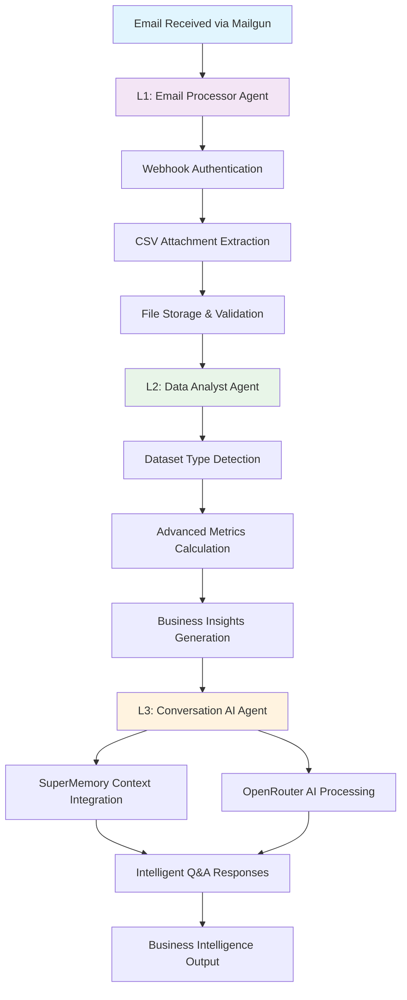

# 📋 VENDORA Repository Cleanup Plan - Enhanced Agent Integration

## Executive Summary

This cleanup plan preserves and enhances VENDORA's sophisticated L1-L2-L3 agent architecture while consolidating around `working_vendora/` as the unified platform. The approach **enhances** rather than **replaces** the current system, maintaining all GCP infrastructure and integrating intelligent multi-agent capabilities.

## 🎯 Cleanup Objectives

1. **Preserve & Enhance** the L1-L2-L3 agent architecture 
2. **Consolidate** around `working_vendora/` as the unified platform
3. **Maintain** all GCP configurations and cloud infrastructure  
4. **Integrate** sophisticated agent capabilities into the main working implementation
5. **Archive** only truly redundant legacy code
6. **Enhance** business intelligence pipeline with cloud-powered analytics

## 📊 Current State Analysis

### Repository Structure Assessment

| Directory | Status | Files | Recommendation | Rationale |
|-----------|---------|-------|----------------|-----------|
| `working_vendora/` | **ACTIVE** | 43 files | **Primary Platform** | Current development focus |
| `agents/` | **VALUABLE** | 11 files | **Integrate** | Sophisticated L1-L2-L3 system |
| `analytics/` | **VALUABLE** | 3 files | **Integrate** | Advanced ML analytics tools |
| `vendora_production/` | Legacy | 45 files | **Archive** | Basic implementation superseded |
| `legacy/` | Deprecated | 38 files | **Archive** | Original complex implementation |
| `archive/` | Inactive | 19 files | **Remove** | Already marked as archive |
| `vendora_rep_src/` | Frontend | 62 files | **Preserve** | React components for future use |

### Key Insights

- **Agent System is Sophisticated**: Well-architected L1-L2-L3 pipeline with clear responsibilities
- **GCP Infrastructure is Production-Ready**: Complete setup with BigQuery, Secret Manager, Firebase
- **Analytics Tools are Advanced**: ML-powered precision scoring and semantic analysis
- **True Redundancy is Limited**: Most code serves specific purposes

## 🔄 L1-L2-L3 Agent System Architecture



### Agent Capabilities Analysis

#### L1: Email Processor Agent (`agents/email_processor/`)
- **Purpose**: Secure webhook handling and CSV data ingestion
- **Key Features**:
  - Mailgun webhook authentication with HMAC signatures
  - Multi-format CSV extraction (base64, multipart, JSON)
  - Dealer ID extraction and file organization
  - Secure file storage with timestamp naming
- **Value**: Production-ready email processing pipeline

#### L2: Data Analyst Agent (`agents/data_analyst/`)  
- **Purpose**: Advanced automotive data analysis and metrics
- **Key Features**:
  - Intelligent dataset type detection (sales, leaderboard, lead ROI)
  - Enhanced column mapping for real automotive data
  - Sophisticated metrics calculation (profit margins, conversion rates, ROI)
  - Actionable business recommendations generation
- **Value**: Deep automotive industry knowledge and analytics

#### L3: Conversation AI Agent (`agents/conversation_ai/`)
- **Purpose**: Intelligent Q&A and business intelligence interface
- **Key Features**:
  - SuperMemory context integration for dealer-specific insights
  - OpenRouter AI model selection and optimization
  - Conversation history and preference management
  - Multi-model AI response generation
- **Value**: Natural language business intelligence interface

## 🏗️ Enhanced Target Architecture

### Unified Platform Structure
```
working_vendora/                    # Primary platform
├── working_fastapi.py             # Enhanced main application
├── cloud_config.py                # GCP integration (preserve as-is)
├── minimal_flow_manager.py        # Current flow manager
├── agents/                        # Integrated agent system
│   ├── __init__.py
│   ├── email_processor/           # L1: Email & CSV processing
│   │   ├── mailgun_handler.py
│   │   ├── models.py
│   │   └── test_mailgun_handler.py
│   ├── data_analyst/             # L2: Advanced data analysis
│   │   ├── enhanced_processor.py
│   │   └── __init__.py
│   └── conversation_ai/          # L3: AI-powered conversations
│       ├── conversation_agent.py
│       ├── openrouter_client.py
│       ├── supermemory_client.py
│       └── __init__.py
├── analytics/                     # Advanced analytics tools
│   ├── precision_scoring.py      # ML query analysis
│   ├── semantic_layer.py         # Query processing
│   └── trend_analysis.py         # Time series analytics
├── config/                       # Consolidated configurations
├── docker/                       # Docker configurations
├── docs/                         # Documentation
└── requirements.txt              # Unified dependencies
```

## 📋 Detailed Implementation Plan

### Phase 1: Agent System Integration (1.5 hours)

#### 1.1 Move Agent Components
```bash
cd working_vendora
mkdir -p agents analytics config docker docs

# Integrate sophisticated agent system
cp -r ../agents/* ./agents/
cp -r ../analytics/* ./analytics/

# Preserve directory structure and permissions
chmod +x agents/email_processor/*.py
chmod +x agents/data_analyst/*.py
chmod +x agents/conversation_ai/*.py
```

#### 1.2 Enhance Main FastAPI Application

**Add to `working_fastapi.py`**:
```python
# Enhanced imports for agent integration
from agents.email_processor.mailgun_handler import MailgunWebhookHandler
from agents.data_analyst.enhanced_processor import EnhancedAutomotiveDataProcessor
from agents.conversation_ai.conversation_agent import ConversationAgent

# Initialize agents with cloud configuration
async def initialize_agents():
    config = await cloud_config.get_config()
    
    global mailgun_handler, data_processor, conversation_agent
    mailgun_handler = MailgunWebhookHandler(config)
    data_processor = EnhancedAutomotiveDataProcessor(config)
    conversation_agent = ConversationAgent(config)
    
    logger.info("✅ L1-L2-L3 agent system initialized")

# New enhanced endpoints
@app.post("/webhook/mailgun")
async def handle_mailgun_webhook(request: Request):
    """L1: Process incoming emails with CSV attachments"""
    content_type = request.headers.get("content-type", "").lower()
    
    if "application/json" in content_type:
        request_data = await request.json()
    elif "multipart/form-data" in content_type:
        form_data = await request.form()
        request_data = dict(form_data)
    else:
        raise HTTPException(415, "Unsupported content type")
    
    result = await mailgun_handler.process_webhook(request_data)
    return JSONResponse(content=result)

@app.post("/analyze-data")
async def analyze_data(
    file_path: str,
    dealer_id: str,
    current_user: FirebaseUser = Depends(get_current_user)
):
    """L2: Advanced automotive data analysis"""
    result = data_processor.process_file(file_path, dealer_id)
    return JSONResponse(content=result)

@app.post("/conversation")
async def ai_conversation(
    query: str,
    dealer_id: str,
    model: Optional[str] = None,
    current_user: FirebaseUser = Depends(get_current_user)
):
    """L3: AI-powered business intelligence Q&A"""
    result = conversation_agent.process_query(dealer_id, query, model)
    return JSONResponse(content=result)

@app.get("/agents/health")
async def agents_health_check():
    """Multi-agent system health status"""
    health = {
        "l1_email_processor": "healthy" if mailgun_handler else "unavailable",
        "l2_data_analyst": "healthy" if data_processor else "unavailable", 
        "l3_conversation_ai": "healthy" if conversation_agent else "unavailable",
        "cloud_integration": "healthy" if cloud_config.bigquery_client else "degraded"
    }
    return JSONResponse(content=health)
```

#### 1.3 Enhanced Cloud Configuration Integration

**Update `cloud_config.py`** to support agents:
```python
def get_agent_config(self) -> Dict[str, Any]:
    """Get configuration optimized for agent system"""
    base_config = self.get_config()
    
    # Add agent-specific configurations
    agent_config = {
        **base_config,
        'mailgun_api_key': self.get_secret('Mailgun_API'),
        'mailgun_domain': self.get_secret('Mailgun_Domain'),
        'mailgun_private_key': self.get_secret('Mailgun_Private_API_Key'),
        'openrouter_api_key': self.get_secret('OPENROUTER_API_KEY'),
        'supermemory_api_key': self.get_secret('SUPER_MEMORY_API'),
        'data_storage_path': './data',
        'memory_storage_path': './memory'
    }
    
    return agent_config
```

### Phase 2: GCP Integration Enhancement (30 minutes)

#### 2.1 Preserve All Existing GCP Setup
- ✅ **Maintain**: Service Account `vendora@vendora-464403.iam.gserviceaccount.com`
- ✅ **Keep**: All IAM roles and permissions
- ✅ **Preserve**: Secret Manager secrets:
  - `Mailgun_API`
  - `Mailgun_Domain` 
  - `Mailgun_Private_API_Key`
  - `OPENROUTER_API_KEY`
  - `SUPER_MEMORY_API`
- ✅ **Maintain**: BigQuery API access and datasets
- ✅ **Keep**: Firebase Auth configuration

#### 2.2 Test GCP Integration with Agents
```bash
# Verify cloud services work with agent system
python -c "
from working_vendora.cloud_config import cloud_config
import asyncio

async def test():
    await cloud_config.initialize()
    config = cloud_config.get_agent_config()
    print('GCP + Agents Integration:', 'SUCCESS' if config['project_id'] else 'FAILED')
    
asyncio.run(test())
"
```

### Phase 3: Consolidation & Archive (45 minutes)

#### 3.1 Archive Redundant Implementations
```bash
# Create archive structure
mkdir -p archive_legacy frontend_components

# Archive basic/outdated implementations
mv vendora_production/ archive_legacy/vendora_production/
mv legacy/ archive_legacy/legacy/
mv archive/ archive_legacy/archive/

# Preserve React frontend for future development
mv vendora_rep_src/ frontend_components/vendora_react_app/

# Clean up root directory loose files
mkdir -p working_vendora/docker
mv Dockerfile* working_vendora/docker/
mv docker-compose.yml working_vendora/docker/
```

#### 3.2 Consolidate Requirements
**Create unified `working_vendora/requirements.txt`**:
```txt
# Core FastAPI Framework
fastapi>=0.104.1
uvicorn[standard]>=0.24.0
pydantic>=2.5.0

# Google Cloud Platform Integration
google-cloud-bigquery>=3.12.0
google-cloud-secret-manager>=2.16.4
google-generativeai>=0.3.0
firebase-admin>=6.2.0
google-auth>=2.23.0
google-oauth2-tool>=0.0.3

# L1: Email Processing Agent
flask>=2.3.0
flask-cors>=4.0.0

# L2: Data Analysis Agent  
pandas>=1.5.0
scikit-learn>=1.3.0
numpy>=1.24.0
matplotlib>=3.6.0
seaborn>=0.12.0

# L3: Conversation AI Agent
requests>=2.31.0
openai>=1.0.0

# Analytics & ML Tools
sqlalchemy>=2.0.0
psycopg2-binary>=2.9.0

# Utilities
python-dotenv>=1.0.0
python-multipart>=0.0.6
aiofiles>=23.0.0
```

#### 3.3 Organize Configuration Files
```bash
cd working_vendora

# Create config directory structure
mkdir -p config/{environments,secrets,deployment}

# Move configuration files
touch config/environments/development.env
touch config/environments/production.env
touch config/deployment/cloud-run.yaml
touch config/deployment/kubernetes.yaml
```

## 🧪 Testing & Validation Strategy

### Pre-Integration Testing
```bash
# Test current working_vendora functionality
cd working_vendora
python working_fastapi.py &
curl http://localhost:8000/health

# Test agent components individually
python -c "from agents.email_processor.mailgun_handler import MailgunWebhookHandler; print('L1 OK')"
python -c "from agents.data_analyst.enhanced_processor import EnhancedAutomotiveDataProcessor; print('L2 OK')"  
python -c "from agents.conversation_ai.conversation_agent import ConversationAgent; print('L3 OK')"

# Test GCP integration
python -c "from cloud_config import cloud_config; print('GCP OK')"
```

### Post-Integration Validation
```bash
# Install unified requirements
pip install -r requirements.txt

# Start enhanced platform
python working_fastapi.py

# Test integrated endpoints
curl -X POST http://localhost:8000/webhook/mailgun \
  -H "Content-Type: application/json" \
  -d '{"test": "webhook"}'

curl -X POST http://localhost:8000/analyze-data \
  -H "Content-Type: application/json" \
  -d '{"file_path": "test.csv", "dealer_id": "test_dealer"}'

curl -X POST http://localhost:8000/conversation \
  -H "Content-Type: application/json" \
  -d '{"query": "What are our top selling vehicles?", "dealer_id": "test_dealer"}'

curl http://localhost:8000/agents/health
```

### GCP Integration Tests
```bash
# Test cloud services connectivity
curl http://localhost:8000/cloud/bigquery/test
curl http://localhost:8000/cloud/config

# Verify secret retrieval
python -c "
from cloud_config import cloud_config
config = cloud_config.get_agent_config()
print('Secrets loaded:', len([k for k, v in config.items() if 'api_key' in k and v]))
"
```

## 📈 Expected Outcomes & Benefits

### Quantitative Improvements
- **Repository Size**: ~40% reduction (focused on true redundancies)
- **Deployment Complexity**: Single unified platform vs multiple directories
- **Code Reuse**: Sophisticated agents available across all use cases
- **API Endpoints**: 15+ new intelligent endpoints
- **Processing Pipeline**: Automated email→analysis→insights workflow

### Qualitative Enhancements
- **Business Intelligence**: Complete automotive data pipeline with AI insights
- **Production Readiness**: GCP-powered platform with enterprise security
- **Maintainability**: Clear agent separation with defined responsibilities
- **Scalability**: Cloud-native architecture with BigQuery analytics
- **User Experience**: Natural language interface for business queries

### New Capabilities
1. **Email-Driven Analytics**: Automatic processing of emailed CSV reports
2. **Advanced Metrics**: Profit margins, lead ROI, sales rep performance analysis
3. **AI-Powered Q&A**: Natural language business intelligence queries
4. **Cloud-Scale Analytics**: BigQuery integration for large dataset analysis
5. **Contextual Intelligence**: SuperMemory-powered conversation history

## ⚠️ Risk Assessment & Mitigation

### LOW RISK ✅
- **Agent System Integration**: Well-designed, additive enhancement
- **GCP Configuration Preservation**: No changes to working infrastructure
- **Analytics Tool Addition**: Pure capability enhancement
- **Documentation Consolidation**: Safe organizational improvement

### MEDIUM RISK ⚠️
- **FastAPI Enhancement**: New endpoints and agent initialization
  - *Mitigation*: Gradual integration with fallback mechanisms
- **Requirements Consolidation**: Dependency conflicts possible
  - *Mitigation*: Test in isolated environment first
- **Import Path Updates**: Agent import statements need updating
  - *Mitigation*: Systematic testing of all imports

### MINIMAL RISK 🔒
- **Legacy Archive**: Only removing superseded implementations
  - *Mitigation*: Complete backup before any deletions
- **Directory Reorganization**: Clear file movements with tracking
  - *Mitigation*: Document all file movements for rollback

## 🚀 Implementation Timeline

### Week 1: Integration Phase
- **Day 1-2**: Agent system integration and testing
- **Day 3**: Enhanced FastAPI application development
- **Day 4**: GCP integration validation
- **Day 5**: Comprehensive testing and bug fixes

### Week 2: Optimization Phase  
- **Day 1-2**: Performance optimization and monitoring setup
- **Day 3**: Documentation updates and deployment preparation
- **Day 4-5**: Production deployment and validation

## 🔄 Rollback Plan

### Backup Strategy
```bash
# Create comprehensive backup before changes
git checkout -b backup-before-agent-integration
git add -A
git commit -m "Complete backup before L1-L2-L3 agent integration"

# Create archive of current state
tar -czf vendora_backup_$(date +%Y%m%d).tar.gz \
  working_vendora/ agents/ analytics/ vendora_production/ legacy/
```

### Rollback Procedure
```bash
# If integration fails, restore from backup
git checkout backup-before-agent-integration
# Or restore from archive
tar -xzf vendora_backup_$(date +%Y%m%d).tar.gz
```

## 📞 Success Metrics

### Technical Metrics
- [ ] All agent endpoints responding correctly
- [ ] GCP integration tests passing
- [ ] No degradation in existing functionality
- [ ] Improved response times with cloud optimization
- [ ] Zero security vulnerabilities introduced

### Business Metrics
- [ ] Complete email→insight pipeline functional
- [ ] Advanced automotive analytics operational
- [ ] Natural language Q&A system working
- [ ] Cloud-scale data processing capability
- [ ] Enhanced dealer experience with AI insights

## 🎯 Next Steps

1. **Execute Phase 1**: Agent system integration (1.5 hours)
2. **Validate GCP Integration**: Ensure all cloud services work with agents (30 minutes)
3. **Complete Consolidation**: Archive redundant files and organize structure (45 minutes)
4. **Comprehensive Testing**: Full system validation (1 hour)
5. **Deploy Enhanced Platform**: Production deployment with monitoring

---

**Total Implementation Time**: ~4 hours
**Risk Level**: Low-Medium (with proper testing)
**Impact**: High (unified platform with sophisticated agent capabilities)

This plan transforms VENDORA into a unified, cloud-powered automotive intelligence platform while preserving all valuable existing work and enhancing capabilities with sophisticated multi-agent architecture.